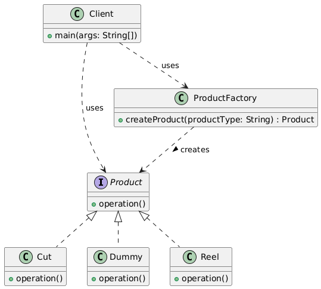

The Factory Pattern is a creational design pattern that provides a way to create objects without exposing the instantiation logic to the client. Instead, the client calls a factory method which returns an instance of a class, usually based on input parameters or conditions.

Use Cases:

When the exact type of the object to create isn’t known until runtime.

To centralize object creation logic, making code easier to maintain.

When you want to avoid tight coupling between client code and concrete classes.

When your system needs to be flexible for adding new types of objects without modifying existing code.
